# Securing GitLab CI/CD with AWS OIDC


## Problem Statement -

* With Gitlab CI/CD, key rotation is a major challenge for any organisation since there is not about just one repository to handle but could be many
* CIS benchmark for AWS recommends to rotate the credentials every 90 days to safeguard the secrets
* Tracking and rotating the keys - since there could be multiple repositories and chances of missing out on credentials rotation would be pretty high
* Also, there could be multiple repercussions & use-cases that can have differing views with different needs. So, this list can potentially be huge in the real world

## Solution Concept -
* To get rid of this key rotation headache, let's move to OIDC supported by AWS
* OIDC (OpenID Connect) is an authentication layer on top of the OAuth 2.0 framework.

    * It is used to authenticate identities with an external identity provider
    * No involvement of keys therefore no such pain of key management
    * AWS provides support to create and manage an OIDC provider such as facebook, google, etc.

## How to Configure
#### ***Configuring AWS***
1. *Search for IAM in AWS services and open the IAM console. Click on the “Identity providers” section at left*
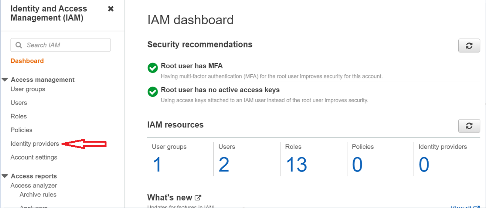
        
2. *Now, click over the “Add provider” option*
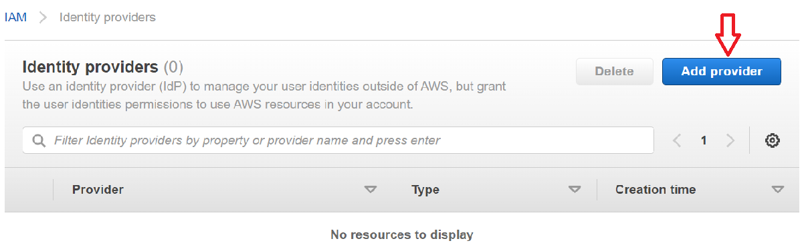

3. *Now configure OpenID Connect.*
    * Provider URL: This is the URL of the GitLab instance. For self-hosted versions, fill-in your GitLab hosted domain. While for SaaS hosted Gitlab, the URL is https://gitlab.com
    * Then, click on “Get thumbprint” to retrieve the thumbprint/hash of the provider’s certificate
    * Audience: Same as the Provider URL. In our case, it is https://gitlab.com
    * Finally, click on “Add provider”
    
    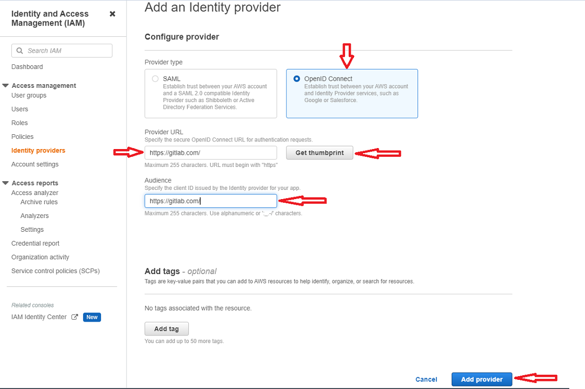

4. *And, provider will start appearing under the “Identity providers” section*
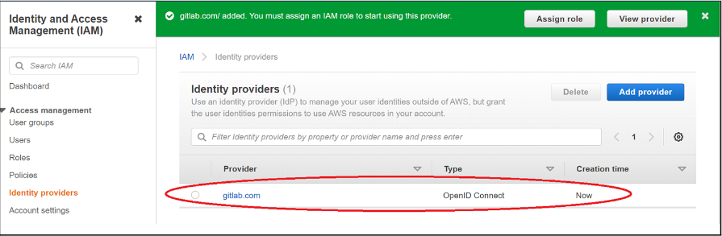

5. *Now go to policies section under IAM and create a policy*
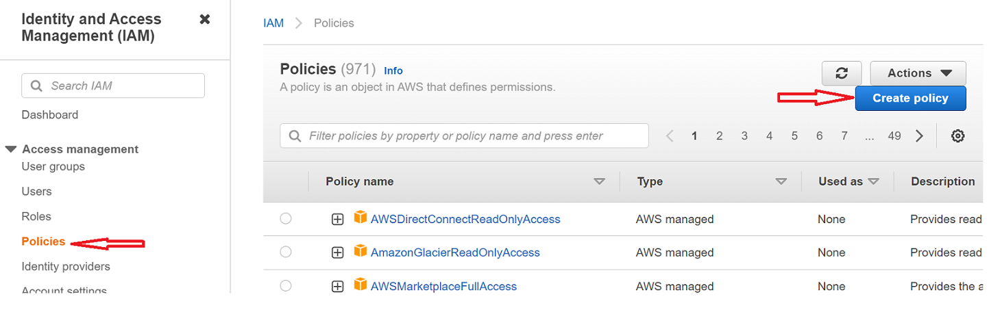

6. *Copy & Paste the below snippet within the policy*
>      {
>
>       "Version": "2012-10-17",
>       "Statement": [
>           {
>               "Sid": "GitLabOIDCPolicy",
>               "Effect": "Allow",
>               "Action": "sts:GetCallerIdentity",
>               "Resource": "*"
>               }
>           ]
>      }

7. *Click “Next” until the “Review Policy” page. Then give a name of choice, for example I gave - Gitlab-OIDC-Policy. And click "Create policy"*

8. *And, the newly created policy will start appearing under the Policies list*
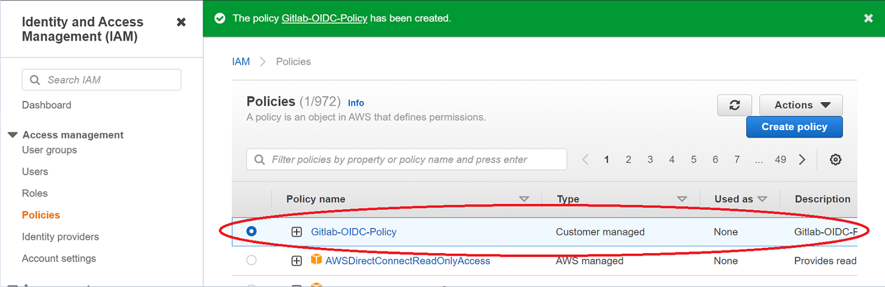

9. *Now, go to the “Roles” section in the IAM console and click on “Create role”. Then choose “Web identity” option and opt for the Identity provider and audience created in the previous step (1.3) & click “Next”*
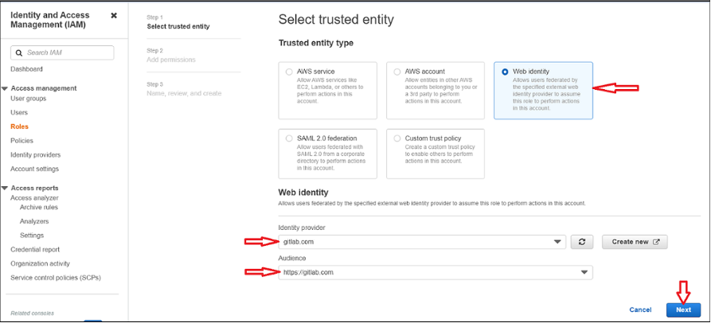

10. *Attach the policy created in previous step (1.8) with the role and click “Next”*
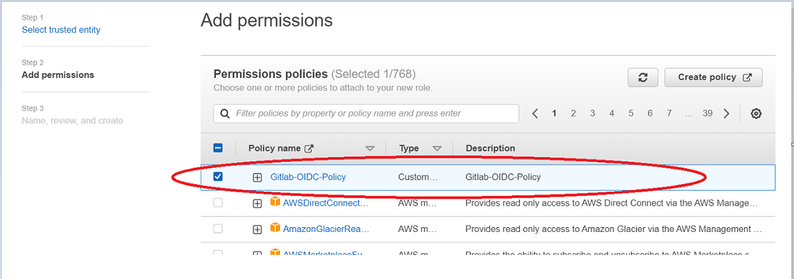

11. *Then give a name of your choice, for example I gave “GitLab-OIDC-Role” & review and click on “Create role”*

12. *And, this will start appearing in “Roles” dashboard*
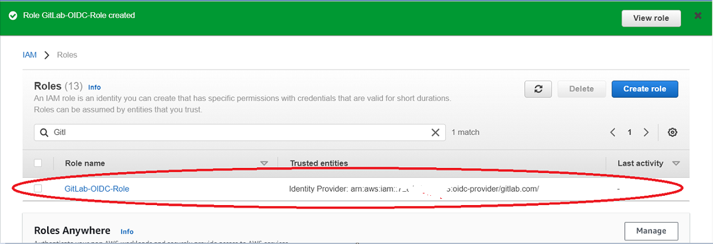

13. *Since, we’ve created an OIDC role but again this poses a security threat. Technically, any GitLab user would be able to assume this role. So, we need to put restrictions by adding down the conditions within the trust document*

14. *Now, go to the “Trust relationships” tab under the created role (step 1.12) and click on “Edit trust policy”*
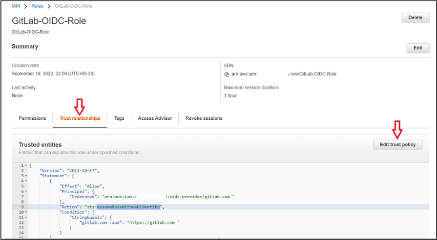

15. *And, append the below snippet in the trust policy and click over “Update Policy”*
>
```
{
    "Condition": {
        "StringEquals": {
            "gitlab.com:sub": "project_path:mygroup/myproject:ref_type:branch:ref:main"
        }
    }
}
```
More fields to be used in the condition can be found [here](https://docs.gitlab.com/ee/ci/cloud_services/index.html#configure-a-conditional-role-with-oidc-claims)

16. *And, final trust policy would be like -*
>
```
    {
    "Version": "2012-10-17",
    "Statement": [
            {
                "Effect": "Allow",
                "Principal": {
                        "Federated": "arn:aws:iam::xxxxxxxxxxx:oidc-provider/gitlab.com"
                },
                "Action": "sts:AssumeRoleWithWebIdentity",

                "Condition": {
                        "StringEquals": {
                                "gitlab.com:aud": "https://gitlab.com",
                                "gitlab.com:sub": "project_path:vineetp/sample_oidc_proj:ref_type:branch:ref:main"
                        }
                }
            }
        ]
    }
``` 


#### ***Configuring AWS OIDC in GitLab***
Now we are done with configuring AWS OIDC. It’s time to head over to GitLab to configure the project for retrieving the temporary credentials from AWS STS (Security Token Service). Follow below steps to configure the GitLab correctly.
    
1. *Open the GitLab Project repository you want to configure and go to*
>Settings -> CI/CD -> Variables -> Add variable

2. *Now, Add the “ROLE_ARN” variable in the GitLab. And, value of this “ROLE_ARN” variable should be the arn of the previously created OIDC role (step 1.12)*
>arn:aws:iam::XYXYYXYXYXY:role/GitLab-OIDC-Role
>
>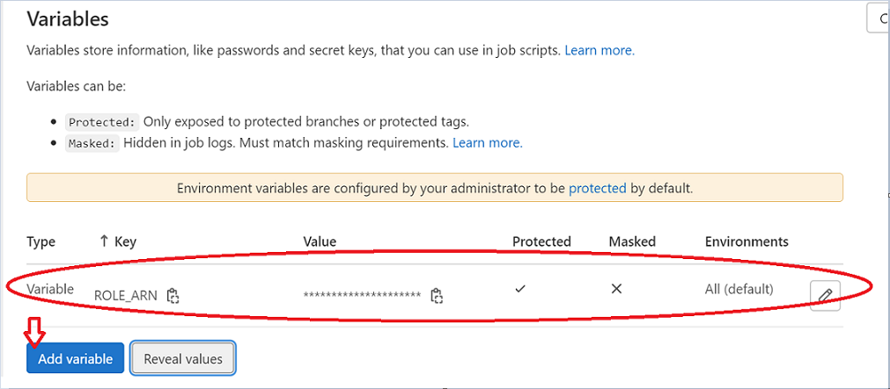

3. *There is another variable called “CI_JOB_JWT_V2” and is predefined by GitLab. CI_JOB_JWT_V2 would allow AWS OIDC and other providers to leverage GitLab's CI JWT Token to authenticate a pipeline job.*

4. *Now, add the below snippet to your jobs in .gitlab-ci.yml file to retrieve temporary short-lived credentials*
>
```
assume role:
script:
    - >
        STS=$(aws sts assume-role-with-web-identity
        --role-arn arn:aws:iam::XYXYXYXYXYXY:role/GitLab-OIDC-Role
        --role-session-name "GitLabRunner-${CI_PROJECT_ID}-${CI_PIPELINE_ID}"
        --web-identity-token $CI_JOB_JWT_V2
        --duration-seconds 3600
        --query 'Credentials.[AccessKeyId,SecretAccessKey,SessionToken]'
        --output text)

    - export AWS_ACCESS_KEY_ID=$(echo $STS | cut -d' ' -f1)
    - export AWS_SECRET_ACCESS_KEY=$(echo $STS | cut -d' ' -f2)
    - export AWS_SESSION_TOKEN=$(echo $STS | cut -d' ' -f3)
```


5. *My sample .gitlab-ci.yml file look like below. You can customise as per your needs*
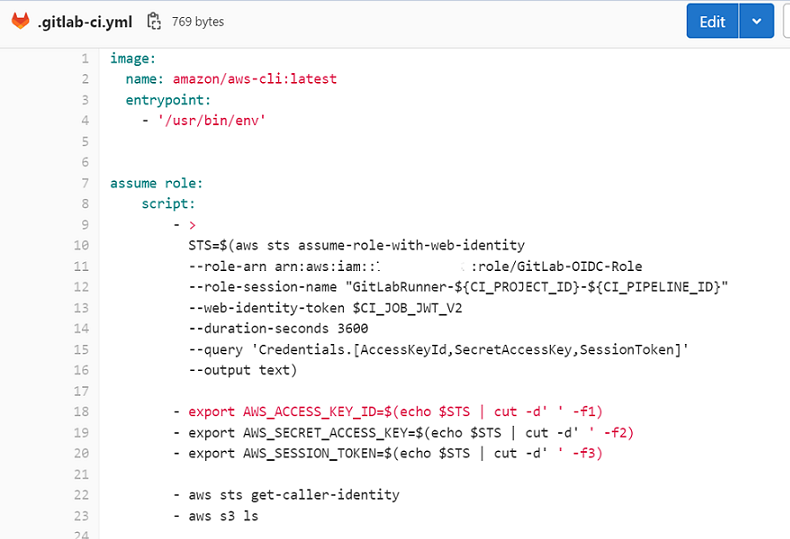

6. *Sample pipeline output will look like below*
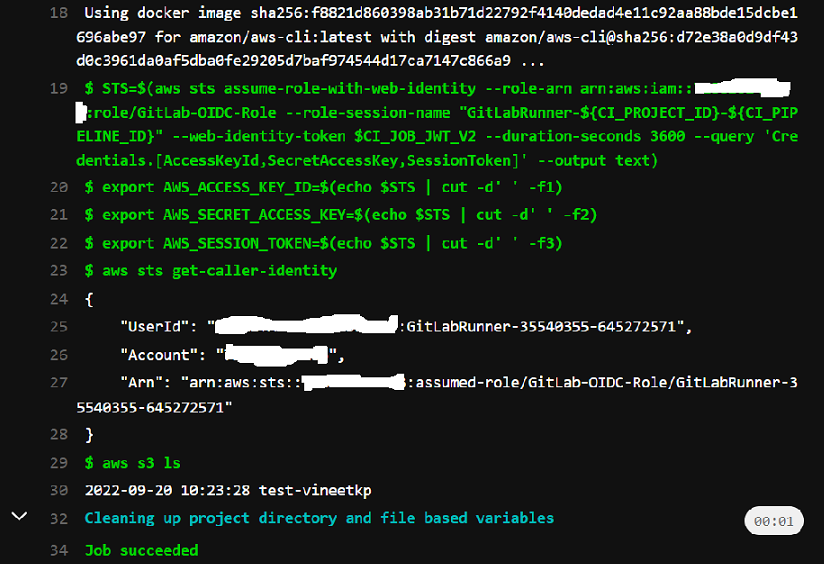


## Conclusion
By configuring the OIDC rightly and can now run Terraform script and other activities in the AWS account from GitLab.

On high level, there are 5 major steps for OIDC configuration that we have to carry out -
>
```   
1. Configure Identity Provider in AWS
2. Create an AWS Policy for your GitLab OIDC
3. Create an AWS role and attach the created policy in that role
4. Configure the trust relationship in the role so as to restrict the unintended access
5. Finally configure the OIDC role in GitLab and retrieve the temporary set of credentials to perform actions
```